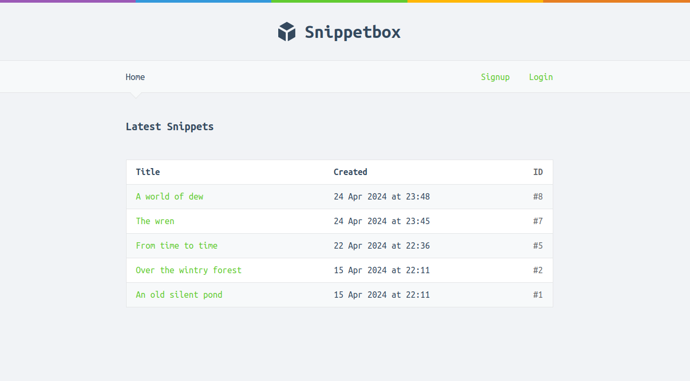

## Snippetbox

This project is the result of following along the build detailed in the book <a href="https://lets-go.alexedwards.net/" target="_blank">Let's Go</a> by Alex Edwards. Snippetbox is a message-saving application with a front-end, a MySQL backend, user authentication, HTTP server configuration, session management, and middleware.

